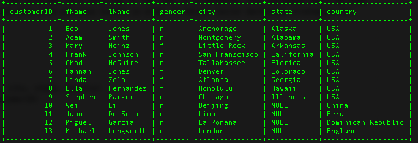

# Database for the Tracking of Concert Attendance

This is a system for the tracking of attendance at concerts and other large events implemented as a SQL database. This database stores information pertaining to concerts at a particular venue. The database stores the name of the artist performing and the date of the concert and then provides data relating to the fans in attendance. This database could be used by the concert venue or the artists to review data from previous events in order to better tailor marketing strategies for future performances.

## Table Schemas

Artist (artistID, artistName)  
Concert (concertID, artistID, date)   
Customer (customerID, fName, lName, gender, city, state, country)  
ConcertCustomerIntersection (concertID, customerID)

## Example Screenshot

